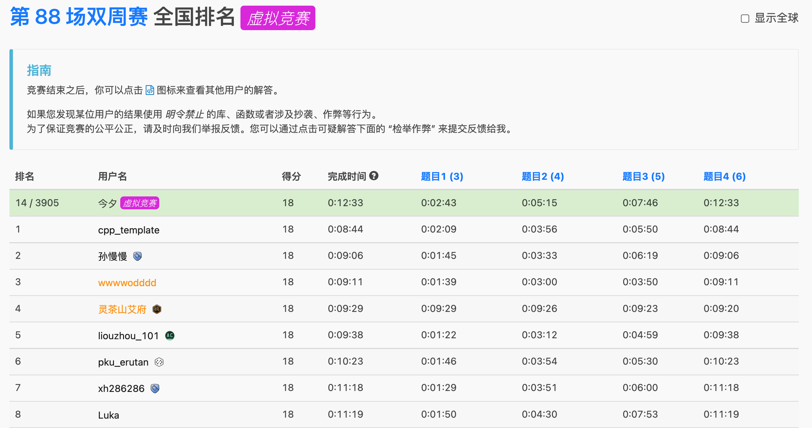

[比赛链接](https://leetcode.cn/contest/biweekly-contest-88/)



## A 删除字符使频率相同

暴力删除每一种字符，然后哈希表判断是否符合题意。

复杂度 $O(n^2)$

=== "C++"
    ```cpp linenums="1"
    class Solution {
    public:
        bool equalFrequency(string word) {
            auto get = [&](string s) {
                unordered_map<char, int> mp;
                for (auto &c : s) {
                    mp[c]++;
                }
                int cnt = mp.begin()->second;
                for (auto &[k, v] : mp) {
                    if (v != cnt) {
                        return false;
                    }
                }
                return true;
            };
            for (int i = 0; i < word.size(); i++) {
                if (get(word.substr(0, i) + word.substr(i + 1))) {
                    return true;
                }
            }
            return false;
        }
    };
    ```
=== "Python"
    ```python linenums="1"
    class Solution:
        def equalFrequency(self, word: str) -> bool:
            def get(s: str):
                c = Counter(s)
                cnt = list(c.items())[0][1]
                for k, v in c.items():
                    if v != cnt:
                        return False
                return True
            for i in range(len(word)):
                if get(word[0:i] + word[i+1:]):
                    return True
            return False
    ```

## B 最长上传前缀

使用一个哈希表记录出现过的数字，然后用一个数字表示当前最长上传前缀。每次返回前更新该变量即可。

时间复杂度 $O(n)$

=== "C++"
    ```cpp linenums="1"
    class LUPrefix {
    public:
        unordered_map<int, int> mp;
        int cur;
        LUPrefix(int n) {
            cur = 1;
        }
        
        void upload(int video) {
            mp[video] = 1;
        }
        
        int longest() {
            while (mp.count(cur)) {
                cur++;
            }
            return cur - 1;
        }
    };
    ```
=== "Python"
    ```python linenums="1"
    class LUPrefix:
        
        def __init__(self, n: int):
            self.cnt = defaultdict(int)
            self.res = 1
            
        def upload(self, video: int) -> None:
            self.cnt[video] = 1

        def longest(self) -> int:
            while self.cnt[self.res] == 1:
                self.res += 1
            return self.res - 1
    ```

## C 所有数对的异或和

设两个数组长度分别为 $n$ 和 $m$，如果 $m$ 为奇数，那么任意一个 $nums2[1]$ 都会出现奇数次。$nums2[i]$ 同理。

=== "C++"
    ```cpp linenums="1"
    class Solution {
    public:
        int xorAllNums(vector<int>& nums1, vector<int>& nums2) {
            int n = nums1.size();
            int m = nums2.size();
            int res = 0;
            if (m & 1) {
                for (auto x : nums1) {
                    res ^= x;
                }
            }
            if (n & 1) {
                for (auto y : nums2) {
                    res ^= y;
                }
            }
            return res;
        }
    };
    ```
=== "Python"
    ```python linenums="1"
    class Solution:
        def xorAllNums(self, nums1: List[int], nums2: List[int]) -> int:
            n, m = len(nums1), len(nums2)
            res = 0
            if n % 2 == 1:
                for y in nums2:
                    res ^= y
            if m % 2 == 1:
                for x in nums1:
                    res ^= x
            return res
    ```

## D 满足不等式的数对数目

将条件移项后可得：

$nums1[i] - nums2[i] \le nums1[j] - nums2[j] + diff$

因此，维护所有 $nums1[i] - nums2[i]$ 的个数，放在「线段树」或者离散化后的「树状数组」中。

每次查询，二分找到位置，去查询即可。

时间复杂度 $O(n\log n)$。

=== "C++"
    ```cpp linenums="1"
    template <typename T>
    struct Fenwick {
        const int n;
        vector<T> a;
        Fenwick(int n): n(n), a(n + 1) {}
        void add(int x, T v){
            for(int i = x; i <= n; i += i & -i) a[i] += v;
        }
        T sum(int x) {
            T rs = 0;
            for(int i = x; i; i -= i & -i) {
                rs += a[i];     
            }
            return rs;
        }
        T rangeSum(int l, int r) {
            if(l > r) return 0;
            return sum(r) - sum(l - 1);
        }
    };

    class Solution {
    public:
        using ll = long long;
        long long numberOfPairs(vector<int>& nums1, vector<int>& nums2, int diff) {
            int n = nums1.size();
            vector<int> vals;
            for (int i = 0; i < n; i++) {
                vals.push_back(nums1[i] - nums2[i]);
            }
            sort(vals.begin(), vals.end());
            int m = vals.size();
            Fenwick<int> fen(m);

            ll res = 0;
            for (int i = 0; i < n; i++) {
                int pos = upper_bound(vals.begin(), vals.end(), nums1[i] - nums2[i] + diff) - vals.begin();
                res += fen.sum(pos);
                pos = lower_bound(vals.begin(), vals.end(), nums1[i] - nums2[i]) - vals.begin() + 1;
                fen.add(pos, 1);
            }
            return res;
        }
    };
    ```

