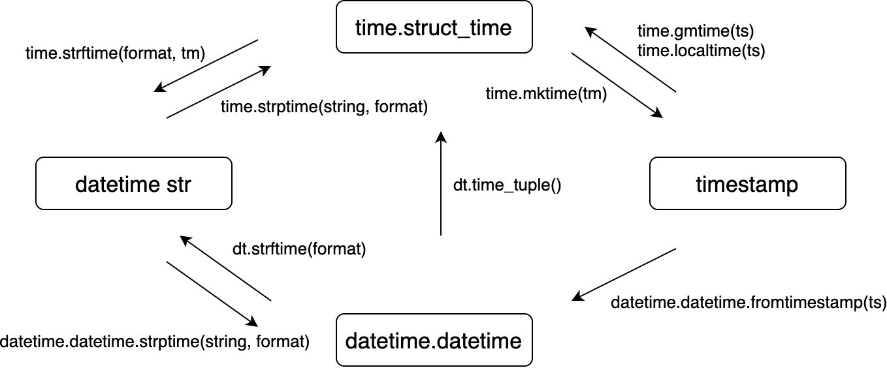

内置的 time 模块可以读取系统时钟的当前时间。在 time 模块中，`time.time()` 和 `time.sleep()` 是最有用的模块。除此之外，`time.mktime()` 也很有用。

### time.time()

返回自 1970 年 1 月 1 日 0 点以来的秒数，是一个浮点数，被称为 UNIX 纪元时间戳。例如：

```python
>>> import time
>>> time.time()
1665579384.791162
```

1665579384.791162 是 2020 年 10 月 12 日晚上 20 点 56 分的时间戳。

### time.sleep() 

该函数可以使程序暂停，参数单位是秒。

该函数会阻塞，直到结束才会继续运行后面的程序。

一个秒表程序示例如下：

=== "超级秒表"
    ```python linenums="1"
    #! python3
    # stopwatch.py - A simple stopwatch program.

    import time

    # Display the program's instructions
    print('Press ENTER to begin. Afterwards, press ENTER to "click" the stopwatch. Press Ctrl-C to quit.')
    input()                     # press ENTER to begin
    print('Started.')           # get the first lap's start time
    startTime = time.time()
    lastTime = startTime
    lapNum = 0

    # Start tracking the lap times.
    try:
        while True:
            input()
            lapTime = round(time.time() - lastTime, 2)
            totalTime = round(time.time() - startTime, 2)
            print('Lap #%s: %s (%s)' % (lapNum, totalTime, lapTime), end='')
            lapNum += 1
            lastTime = time.time() # reset the last lap time
    except KeyboardInterrupt:
        # Handle the Ctrl-C exception to keep its error message from displaying
        print('\nDone')
    ```

### time.mktime()

**TimeTuple** 是 python 用于时间处理的元组，有 9 个元素，分别是：

0. 年份
1. 月份
2. 日期
3. 小时
4. 分钟
5. 秒（0 ~ 61，60 和 61 表示闰秒）
6. 星期几（0 ~ 6，0 是星期一）
7. 一年的第几天
8. 夏令时（-1，,0，1）

使用 `time.localtime()` 可以返回当前时间的元组，相当于 `struct_time` 结构体。

而 `time.mktime()` 就是 `time.localtime()` 的反函数，它接受 `struct_time` 或者 9 个数字的元组。它返回一个浮点数，以便于 `time()` 兼容。

```python3
>>> import time
>>> time.localtime()
time.struct_time(tm_year=2022, tm_mon=10, tm_mday=13, tm_hour=19, tm_min=56, tm_sec=55, tm_wday=3, tm_yday=286, tm_isdst=0)
>>> time.localtime(time.time())
time.struct_time(tm_year=2022, tm_mon=10, tm_mday=13, tm_hour=19, tm_min=57, tm_sec=0, tm_wday=3, tm_yday=286, tm_isdst=0)
>>> time.strftime("%Y-%m-%d %H:%M:%S", time.localtime())
'2022-10-13 19:57:36'
```

### 互相转换

time.struct_time，datetime.datetime，时间戳以及字符串之间的转换关系如下：



其中：

1. `dt` 是 `datetime.datetime` 对象
2. `tm` 是 `time.struct_time` 对象
3. `ts` 是 `timestamp`


所以要从 `datetime` 转到时间戳可以：`time.mktime(dt.timetuple())`。